# My Homelab

Eine selbst gehostete Kubernetes-Infrastruktur auf einem **2-Node-Cluster** (Raspberry Pi als Control Plane + Homeserver als Worker Node) mit GitOps-Deployment via ArgoCD, Cloudflare Zero Trust + **Traefik Ingress** für externen Zugriff, NVIDIA GPU-Unterstützung sowie drei Applikations-Stacks: **Media**, **Fitness** und **Dashboard**.

---

## Inhaltsverzeichnis

- [Screenshots](#screenshots)
- [Netzwerk-Topologie](#netzwerk-topologie)
- [Hardware & Cluster](#hardware--cluster)
- [GitOps-Architektur](#gitops-architektur)
- [Namespaces & Stacks](#namespaces--stacks)
- [Media Stack](#media-stack)
- [Fitness Stack (wger)](#fitness-stack-wger)
- [Dashboard](#dashboard)
- [Storage-Übersicht](#storage-übersicht)
- [NVIDIA GPU](#nvidia-gpu)
- [Port-Übersicht](#port-übersicht)
- [Verzeichnisstruktur](#verzeichnisstruktur)

---

## Screenshots

### ArgoCD — GitOps Dashboard

| ArgoCD Übersicht                                   | Repository Sync                            |
| -------------------------------------------------- | ------------------------------------------ |
| 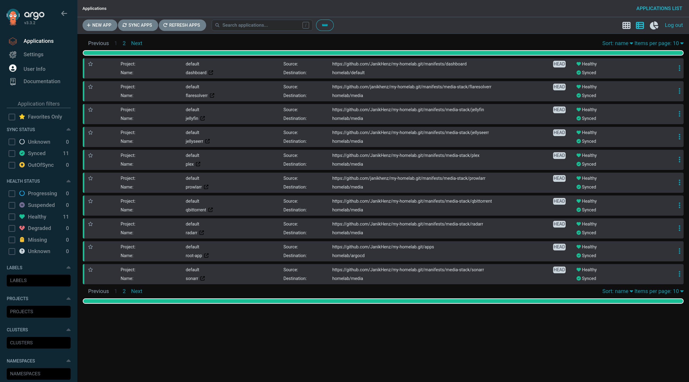 | 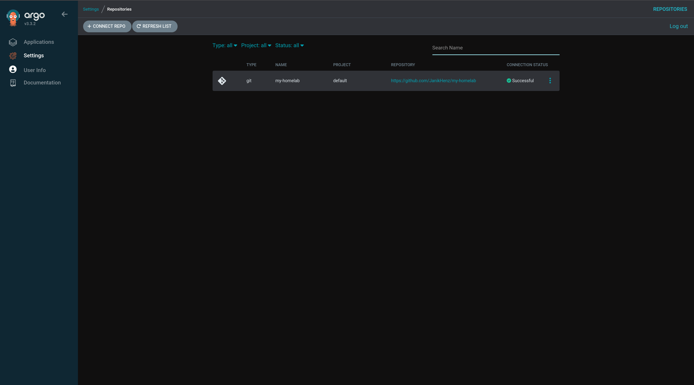 |

### Kubernetes Cluster

| Pods                                             | Deployments                                                   |
| ------------------------------------------------ | ------------------------------------------------------------- |
| 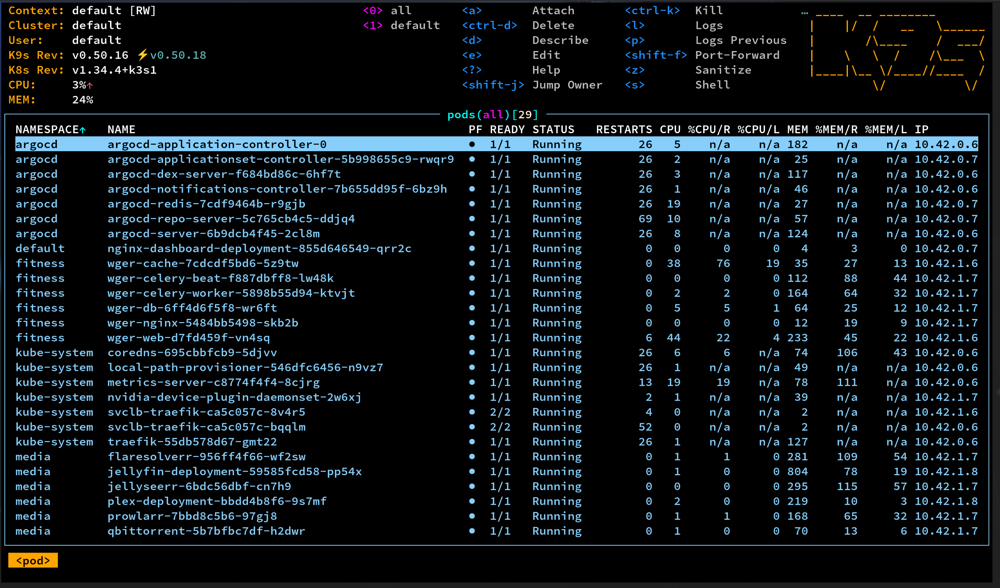 | 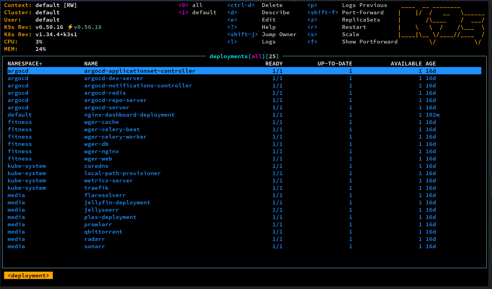 |

| Services                                            | Persistent Volumes                |
| --------------------------------------------------- | --------------------------------- |
| 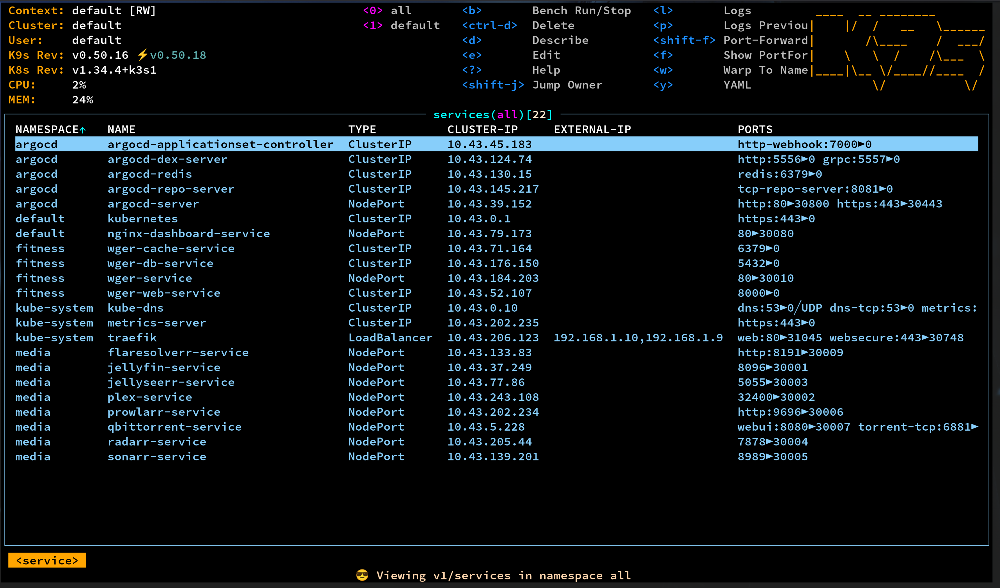 | 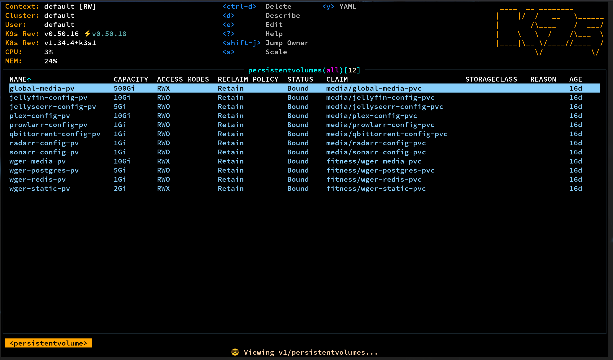 |

| PersistentVolumeClaims               |
| ------------------------------------ |
| 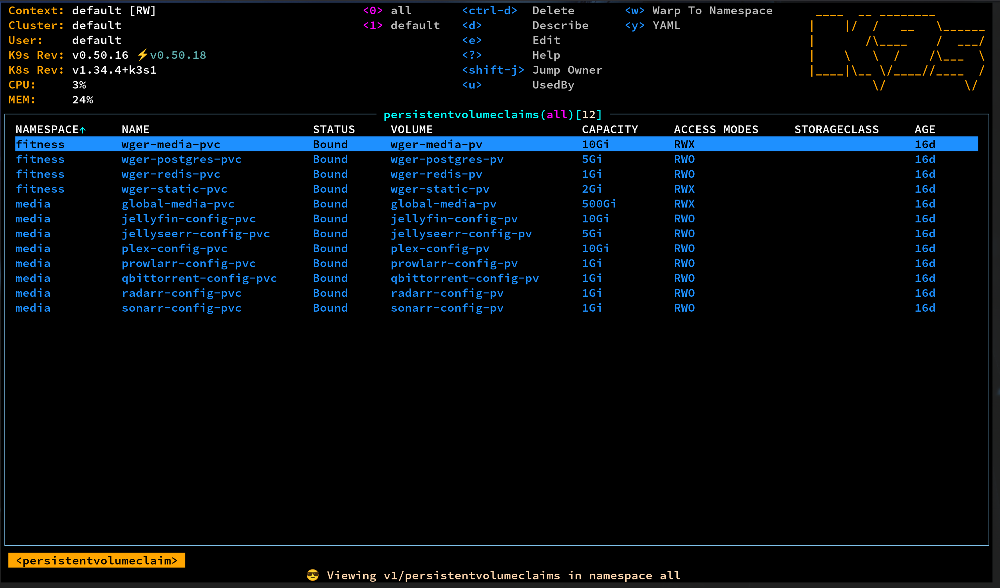 |

### Cloudflare Zero Trust

| Access Dashboard                                     |
| ---------------------------------------------------- |
| 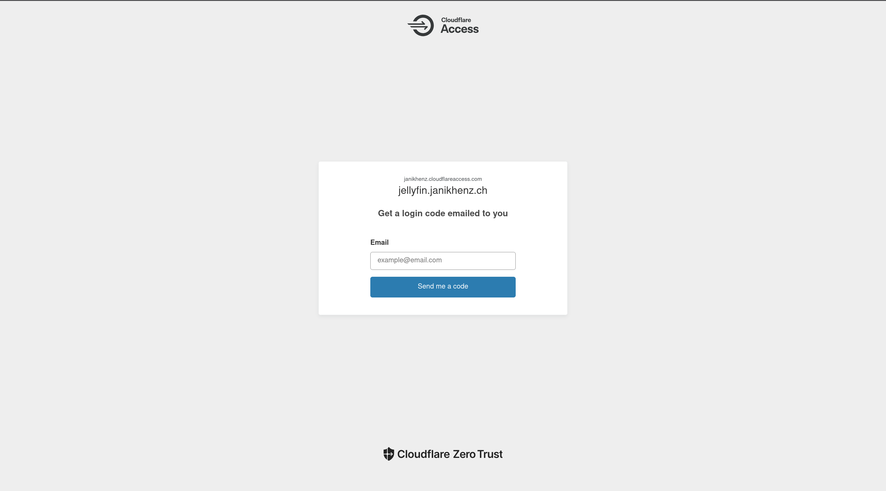 |

### Apps

| Dashboard                                 | Jellyfin Media                           | Plex Media                       |
| ----------------------------------------- | ---------------------------------------- | -------------------------------- |
| 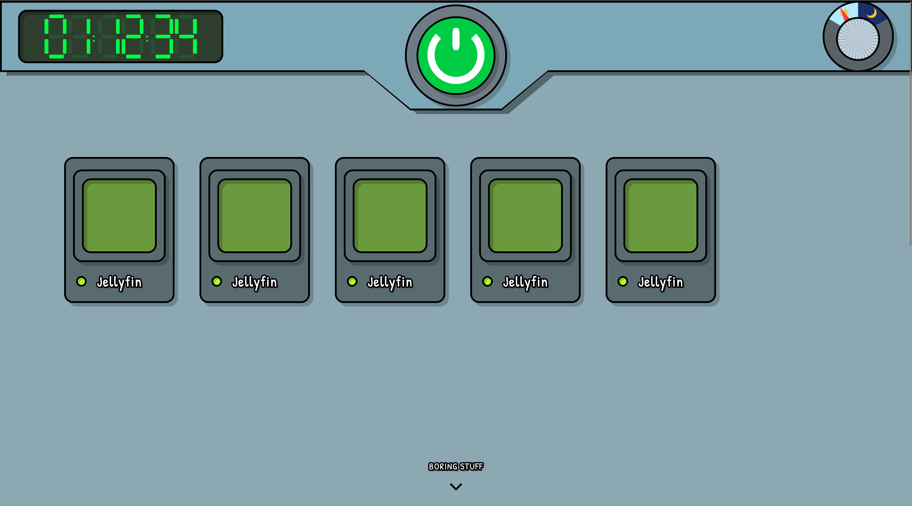 |  |  |

---

## Netzwerk-Topologie

Beide Nodes sind direkt am Router im Heimnetz angeschlossen. Der **Raspberry Pi** fungiert als Kubernetes Control Plane und hostet ArgoCD sowie den `cloudflared`-Tunnel für externen Zugriff via **Cloudflare Zero Trust**. Traffic von außen geht durch den Cloudflare Tunnel auf **Traefik** (Port 80), der dann anhand des Host-Headers per `IngressRoute` an den jeweiligen ClusterIP-Service weiterleitet. Der **Homeserver** ist der einzige Worker Node und führt alle Workloads aus.

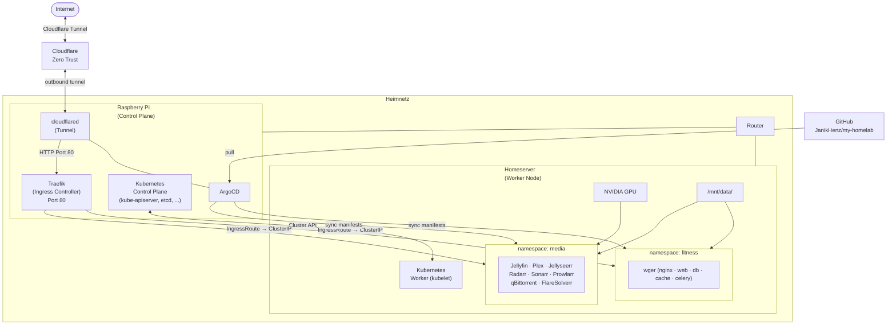

---

## Hardware & Cluster

### Raspberry Pi – Control Plane

| Eigenschaft | Wert                            |
| ----------- | ------------------------------- |
| Rolle       | Kubernetes Control Plane        |
| Software    | Kubernetes, ArgoCD, cloudflared |

### Homeserver – Worker Node

| Eigenschaft | Wert                   |
| ----------- | ---------------------- |
| Hostname    | `homeserver`           |
| Rolle       | Kubernetes Worker Node |

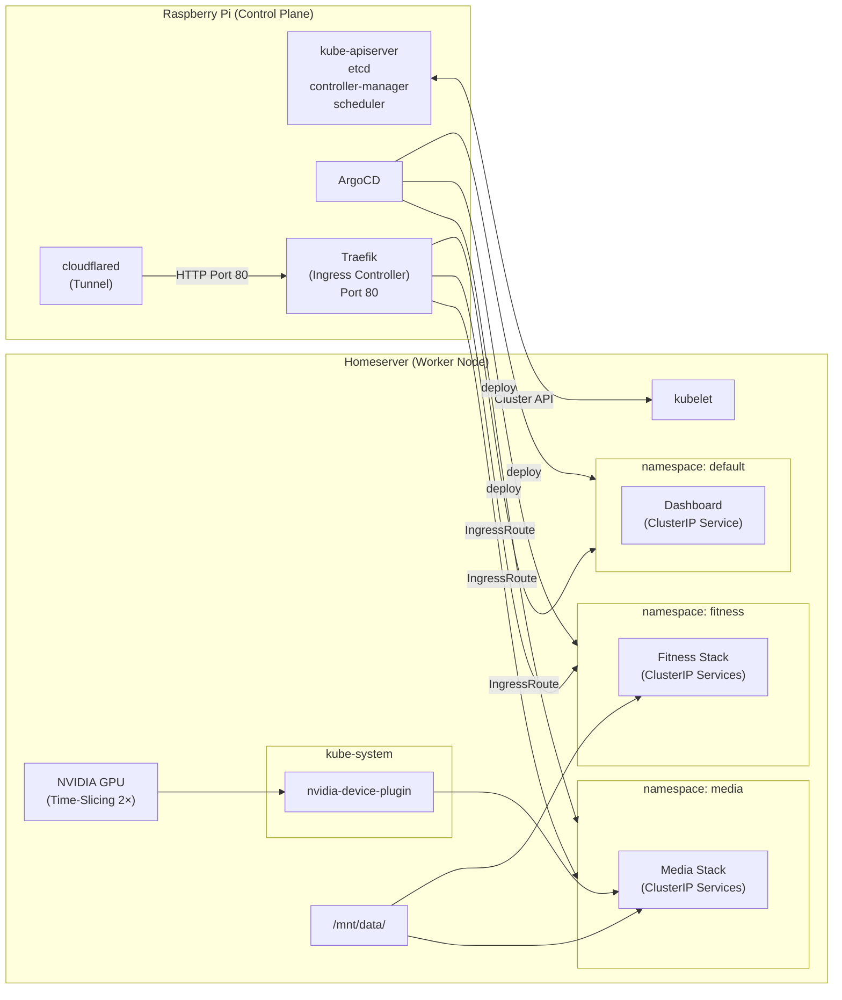

---

## GitOps-Architektur

Das Deployment folgt dem **App of Apps**-Pattern. ArgoCD überwacht das GitHub-Repository und synchronisiert automatisch alle Änderungen in den Cluster.

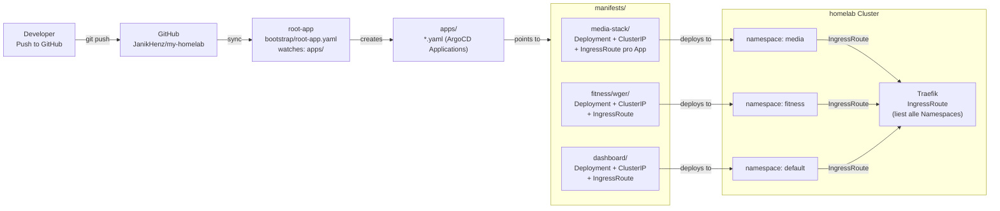

### Sync-Policy

Alle ArgoCD Applications haben:

- **`automated.prune: true`** – verwaiste Ressourcen werden gelöscht
- **`automated.selfHeal: true`** – manuelle Änderungen am Cluster werden revertiert (nur root-app)

---

## Media Stack

Der Media Stack automatisiert das gesamte Medien-Management: von der Suche über den Download bis zur Wiedergabe.

### Datenfluss

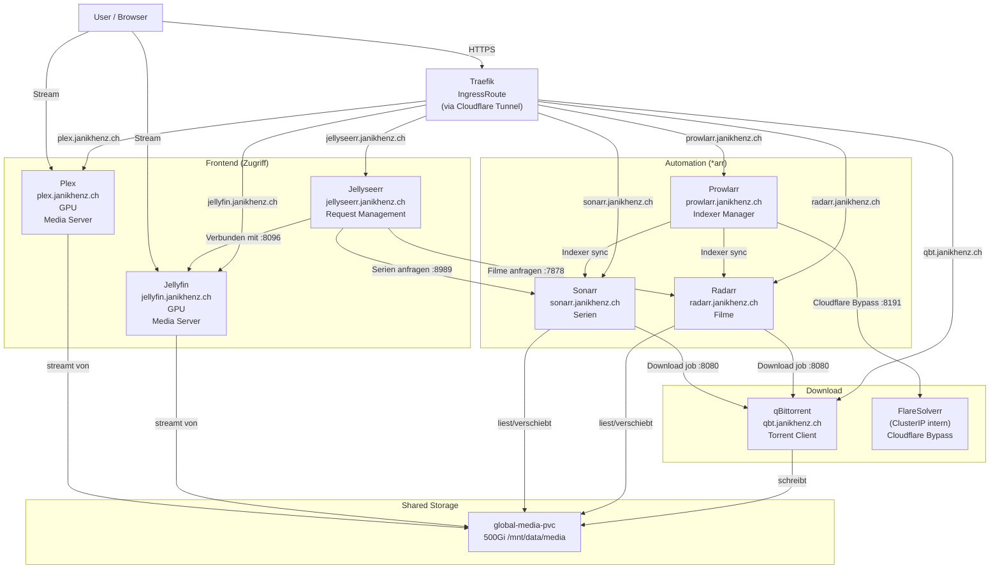

### Services & Images

| Service      | Image                                      | Port  | Service-Typ | Subdomain (Traefik)           | GPU  |
| ------------ | ------------------------------------------ | ----- | ----------- | ----------------------------- | ---- |
| Jellyfin     | `jellyfin/jellyfin:latest`                 | 8096  | ClusterIP   | `jellyfin.janikhenz.ch`       | true |
| Plex         | `plexinc/pms-docker:latest`                | 32400 | ClusterIP   | `plex.janikhenz.ch`           | true |
| Jellyseerr   | `ghcr.io/seerr-team/seerr:latest`          | 5055  | ClusterIP   | `jellyseerr.janikhenz.ch`     |      |
| Radarr       | `linuxserver/radarr:latest`                | 7878  | ClusterIP   | `radarr.janikhenz.ch`         |      |
| Sonarr       | `linuxserver/sonarr:latest`                | 8989  | ClusterIP   | `sonarr.janikhenz.ch`         |      |
| Prowlarr     | `linuxserver/prowlarr:latest`              | 9696  | ClusterIP   | `prowlarr.janikhenz.ch`       |      |
| qBittorrent  | `linuxserver/qbittorrent:latest`           | 8080  | ClusterIP   | `qbt.janikhenz.ch`            |      |
| FlareSolverr | `ghcr.io/flaresolverr/flaresolverr:latest` | 8191  | ClusterIP   | intern (kein öffentl. Zugang) |      |

> **qBittorrent Torrent-Port:** Port 6881 TCP/UDP läuft als separater `NodePort 30008` (`qbittorrent-torrent-service`), da Raw-TCP/UDP-Traffic nicht durch Traefik's HTTP-Layer geroutet werden kann.

---

## Fitness Stack (wger)

wger ist eine selbst gehostete Fitness-Tracking-Anwendung. Der Stack besteht aus einem Django-Backend, PostgreSQL-Datenbank, Redis-Cache und Celery für asynchrone Tasks.

### Interne Architektur

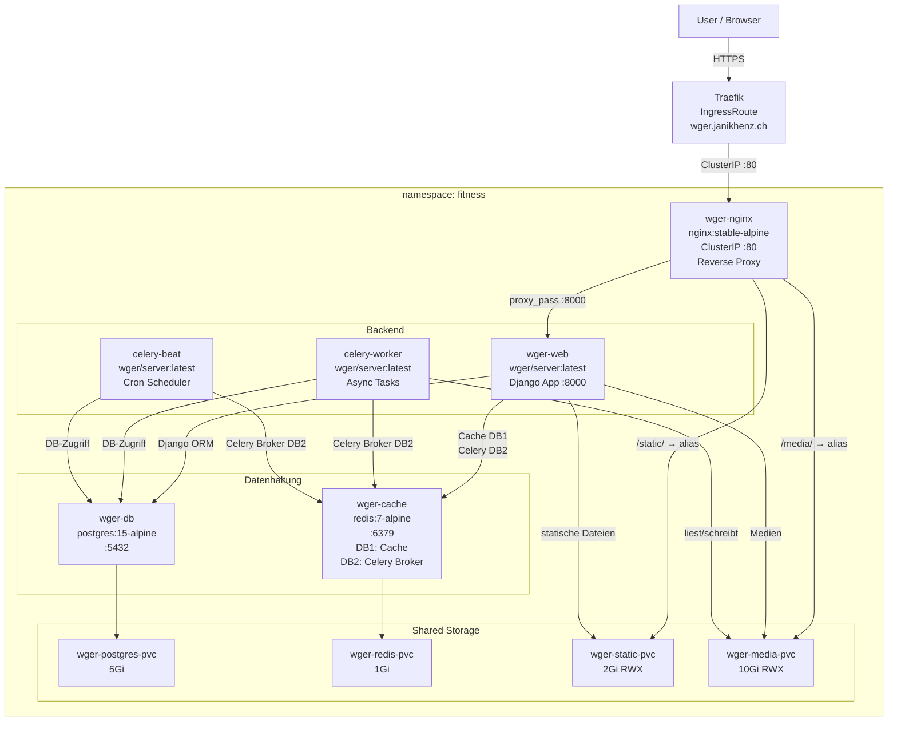

### Services & Images

| Service            | Image                 | Port | Service-Typ | Subdomain (Traefik) |
| ------------------ | --------------------- | ---- | ----------- | ------------------- |
| wger-nginx         | `nginx:stable-alpine` | 80   | ClusterIP   | `wger.janikhenz.ch` |
| wger-web           | `wger/server:latest`  | 8000 | ClusterIP   | —                   |
| wger-db            | `postgres:15-alpine`  | 5432 | ClusterIP   | —                   |
| wger-cache         | `redis:7-alpine`      | 6379 | ClusterIP   | —                   |
| wger-celery-worker | `wger/server:latest`  | —    | —           | —                   |
| wger-celery-beat   | `wger/server:latest`  | —    | —           | —                   |

---

## Dashboard

Eine selbst gehostete Web-Oberfläche auf dem **Raspberry Pi**, die als zentrales Homelab-Dashboard dient. Die Seite besteht aus reinem HTML/CSS/JS und wird über ein nginx-Image bereitgestellt, das automatisch via GitHub Actions gebaut und via ArgoCD deployed wird.

### Deployment-Flow

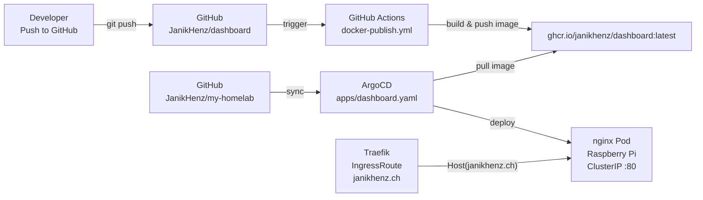

### Details

| Eigenschaft | Wert                                                          |
| ----------- | ------------------------------------------------------------- |
| Image       | `ghcr.io/janikhenz/dashboard:latest`                          |
| Node        | `raspberrypi`                                                 |
| Service-Typ | `ClusterIP`                                                   |
| URL         | `https://janikhenz.ch`                                        |
| Source Repo | [JanikHenz/dashboard](https://github.com/JanikHenz/dashboard) |

---

## Storage-Übersicht

| PVC                      | Größe  | Access Mode | Pfad auf Host                  | Konsumenten                          |
| ------------------------ | ------ | ----------- | ------------------------------ | ------------------------------------ |
| `jellyfin-config-pvc`    | 10 Gi  | RWO         | `/mnt/data/jellyfin/config`    | Jellyfin                             |
| `plex-config-pvc`        | 10 Gi  | RWO         | `/mnt/data/plex/config`        | Plex                                 |
| `radarr-config-pvc`      | 1 Gi   | RWO         | `/mnt/data/radarr/config`      | Radarr                               |
| `sonarr-config-pvc`      | 1 Gi   | RWO         | `/mnt/data/sonarr/config`      | Sonarr                               |
| `qbittorrent-config-pvc` | 1 Gi   | RWO         | `/mnt/data/qbittorrent/config` | qBittorrent                          |
| `prowlarr-config-pvc`    | 1 Gi   | RWO         | `/mnt/data/prowlarr/config`    | Prowlarr                             |
| `jellyseerr-config-pvc`  | 5 Gi   | RWO         | `/mnt/data/jellyseerr/config`  | Jellyseerr                           |
| `global-media-pvc`       | 500 Gi | **RWX**     | `/mnt/data/media`              | Jellyfin, Plex, Radarr, Sonarr, qBit |
| `wger-postgres-pvc`      | 5 Gi   | RWO         | `/mnt/data/wger/postgres`      | wger-db                              |
| `wger-redis-pvc`         | 1 Gi   | RWO         | `/mnt/data/wger/redis`         | wger-cache                           |
| `wger-static-pvc`        | 2 Gi   | **RWX**     | `/mnt/data/wger/static`        | wger-web, wger-nginx                 |
| `wger-media-pvc`         | 10 Gi  | **RWX**     | `/mnt/data/wger/media`         | wger-web, wger-nginx, celery-worker  |

---

## NVIDIA GPU

Die GPU wird über den **NVIDIA Device Plugin** bereitgestellt und via **Time-Slicing** auf 2 virtuelle Slots aufgeteilt. Sowohl Jellyfin als auch Plex können gleichzeitig Hardware-Transcoding nutzen.

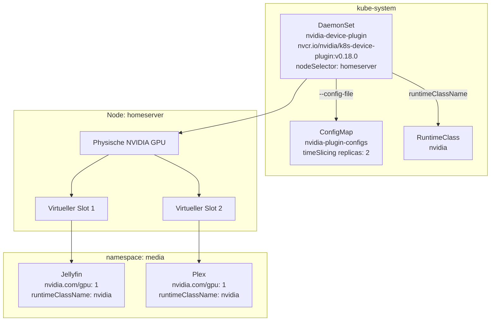

**Konfiguration (nvidia-plugin-configs):**

- `migStrategy: none`
- `deviceListStrategy: envvar`
- `deviceIDStrategy: uuid`
- `timeSlicing.replicas: 2`

---

## Port-Übersicht & Routing

### Öffentlicher Zugang via Traefik IngressRoute

| Service           | Namespace | Container-Port | Service-Typ | Subdomain                         |
| ----------------- | --------- | -------------- | ----------- | --------------------------------- |
| Dashboard (nginx) | default   | 80             | ClusterIP   | `https://janikhenz.ch`            |
| Jellyfin          | media     | 8096           | ClusterIP   | `https://jellyfin.janikhenz.ch`   |
| Plex              | media     | 32400          | ClusterIP   | `https://plex.janikhenz.ch`       |
| Jellyseerr        | media     | 5055           | ClusterIP   | `https://jellyseerr.janikhenz.ch` |
| Radarr            | media     | 7878           | ClusterIP   | `https://radarr.janikhenz.ch`     |
| Sonarr            | media     | 8989           | ClusterIP   | `https://sonarr.janikhenz.ch`     |
| Prowlarr          | media     | 9696           | ClusterIP   | `https://prowlarr.janikhenz.ch`   |
| qBittorrent WebUI | media     | 8080           | ClusterIP   | `https://qbt.janikhenz.ch`        |
| wger (nginx)      | fitness   | 80             | ClusterIP   | `https://wger.janikhenz.ch`       |

### NodePort (nur Torrent-Protokoll — nicht HTTP-routebar)

| Service                     | Namespace | Port         | NodePort  | Zweck                     |
| --------------------------- | --------- | ------------ | --------- | ------------------------- |
| qbittorrent-torrent-service | media     | 6881 TCP/UDP | **30008** | Torrent-Peers (kein HTTP) |

### Interne ClusterIP (kein öffentlicher Zugang)

| Service            | Namespace | Port | Konsumenten      |
| ------------------ | --------- | ---- | ---------------- |
| FlareSolverr       | media     | 8191 | Prowlarr         |
| wger-web-service   | fitness   | 8000 | wger-nginx       |
| wger-db-service    | fitness   | 5432 | wger-web, celery |
| wger-cache-service | fitness   | 6379 | wger-web, celery |

---

## Verzeichnisstruktur

```
my-homelab/
├── bootstrap/
│   └── root-app.yaml          # ArgoCD App of Apps
│
├── apps/                      # ArgoCD Application-Definitionen
│   ├── dashboard.yaml
│   ├── jellyfin.yaml
│   ├── plex.yaml
│   ├── jellyseerr.yaml
│   ├── radarr.yaml
│   ├── sonarr.yaml
│   ├── prowlarr.yaml
│   ├── qbittorrent.yaml
│   ├── flaresolverr.yaml
│   └── wger.yaml
│
├── infrastrucure/             # Cluster-weite Ressourcen
│   ├── namespaces.yaml        # NS: media, fitness
│   ├── media-storage.yaml     # PV/PVC für Media Stack
│   ├── wger-storage.yaml      # PV/PVC für Fitness Stack
│   ├── daemonset.yaml         # NVIDIA Device Plugin DaemonSet
│   ├── nvidia-plugin-config.yaml # Time-Slicing ConfigMap
│   └── nvidia-runtimeclass.yaml  # RuntimeClass: nvidia
│
└── manifests/                 # Kubernetes Manifeste pro App
    ├── dashboard/
    │   ├── nginx-dashboard-deployment.yaml
    │   ├── nginx-dashboard-service.yaml   # ClusterIP
    │   └── nginx-dashboard-ingressroute.yaml  # janikhenz.ch
    ├── media-stack/
    │   ├── jellyfin/          # Deployment + ClusterIP + IngressRoute
    │   ├── plex/
    │   ├── jellyseerr/
    │   ├── radarr/
    │   ├── sonarr/
    │   ├── prowlarr/
    │   ├── qbittorrent/       # ClusterIP (WebUI) + NodePort (torrent 6881) + IngressRoute
    │   └── flaresolverr/      # ClusterIP only (intern)
    └── fitness/
        └── wger/              # 6 Deployments + Services + ConfigMap + IngressRoute
```
