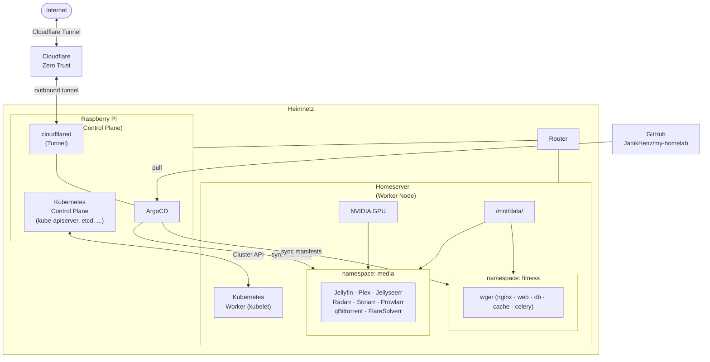
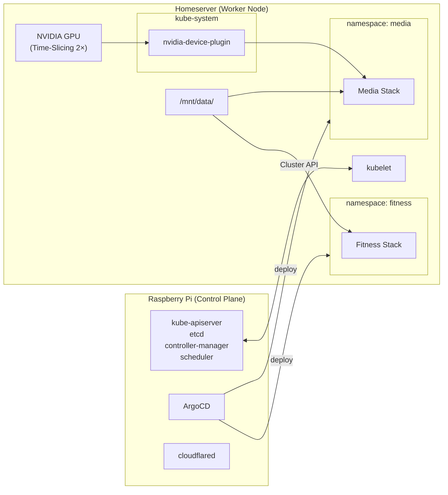
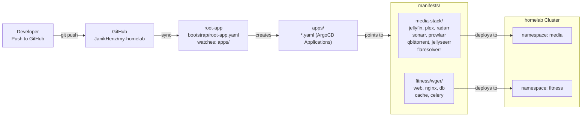
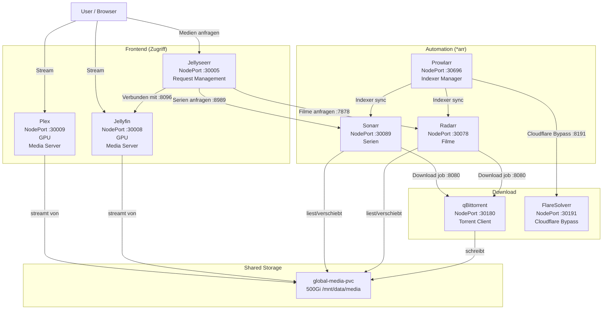
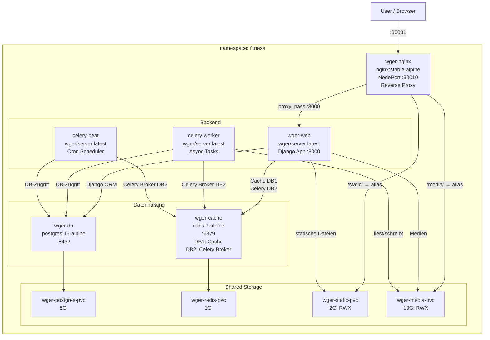
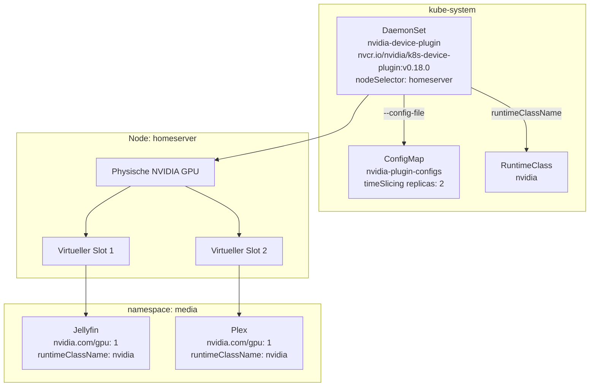

# My Homelab

Eine selbst gehostete Kubernetes-Infrastruktur auf einem **2-Node-Cluster** (Raspberry Pi als Control Plane + Homeserver als Worker Node) mit GitOps-Deployment via ArgoCD, Cloudflare Zero Trust für externen Zugriff, NVIDIA GPU-Unterstützung sowie zwei Applikations-Stacks: **Media** und **Fitness**.

---

## Inhaltsverzeichnis

- [Netzwerk-Topologie](#netzwerk-topologie)
- [Hardware & Cluster](#hardware--cluster)
- [GitOps-Architektur](#gitops-architektur)
- [Namespaces & Stacks](#namespaces--stacks)
- [Media Stack](#media-stack)
- [Fitness Stack (wger)](#fitness-stack-wger)
- [Storage-Übersicht](#storage-übersicht)
- [NVIDIA GPU](#nvidia-gpu)
- [Port-Übersicht](#port-übersicht)
- [Verzeichnisstruktur](#verzeichnisstruktur)

---

## Netzwerk-Topologie

Beide Nodes sind direkt am Router im Heimnetz angeschlossen. Der **Raspberry Pi** fungiert als Kubernetes Control Plane und hostet ArgoCD sowie den `cloudflared`-Tunnel für externen Zugriff via **Cloudflare Zero Trust**. Der **Homeserver** ist der einzige Worker Node und führt alle Workloads aus.



---

## Hardware & Cluster

### Raspberry Pi – Control Plane

| Eigenschaft | Wert                            |
| ----------- | ------------------------------- |
| Rolle       | Kubernetes Control Plane        |
| Software    | Kubernetes, ArgoCD, cloudflared |

### Homeserver – Worker Node

| Eigenschaft | Wert                   |
| ----------- | ---------------------- |
| Hostname    | `homeserver`           |
| Rolle       | Kubernetes Worker Node |



---

## GitOps-Architektur

Das Deployment folgt dem **App of Apps**-Pattern. ArgoCD überwacht das GitHub-Repository und synchronisiert automatisch alle Änderungen in den Cluster.



### Sync-Policy

Alle ArgoCD Applications haben:

- **`automated.prune: true`** – verwaiste Ressourcen werden gelöscht
- **`automated.selfHeal: true`** – manuelle Änderungen am Cluster werden revertiert (nur root-app)

---

## Media Stack

Der Media Stack automatisiert das gesamte Medien-Management: von der Suche über den Download bis zur Wiedergabe.

### Datenfluss



### Services & Images

| Service      | Image                                      | Port  | NodePort | GPU |
| ------------ | ------------------------------------------ | ----- | -------- | --- |
| Jellyfin     | `jellyfin/jellyfin:latest`                 | 8096  | 30001    | true |
| Plex         | `plexinc/pms-docker:latest`                | 32400 | 30002    | true |
| Jellyseerr   | `ghcr.io/seerr-team/seerr:latest`          | 5055  | 30003    |     |
| Radarr       | `linuxserver/radarr:latest`                | 7878  | 30004    |     |
| Sonarr       | `linuxserver/sonarr:latest`                | 8989  | 30005    |     |
| Prowlarr     | `linuxserver/prowlarr:latest`              | 9696  | 30006    |     |
| qBittorrent  | `linuxserver/qbittorrent:latest`           | 8080  | 30007    |     |
| FlareSolverr | `ghcr.io/flaresolverr/flaresolverr:latest` | 8191  | 30009    |     |

---

## Fitness Stack (wger)

wger ist eine selbst gehostete Fitness-Tracking-Anwendung. Der Stack besteht aus einem Django-Backend, PostgreSQL-Datenbank, Redis-Cache und Celery für asynchrone Tasks.

### Interne Architektur



### Services & Images

| Service            | Image                 | Port | Service-Typ | NodePort |
| ------------------ | --------------------- | ---- | ----------- | -------- |
| wger-nginx         | `nginx:stable-alpine` | 80   | NodePort    | 30081    |
| wger-web           | `wger/server:latest`  | 8000 | ClusterIP   | —        |
| wger-db            | `postgres:15-alpine`  | 5432 | ClusterIP   | —        |
| wger-cache         | `redis:7-alpine`      | 6379 | ClusterIP   | —        |
| wger-celery-worker | `wger/server:latest`  | —    | —           | —        |
| wger-celery-beat   | `wger/server:latest`  | —    | —           | —        |

---

## Storage-Übersicht

| PVC                      | Größe  | Access Mode | Pfad auf Host                  | Konsumenten                          |
| ------------------------ | ------ | ----------- | ------------------------------ | ------------------------------------ |
| `jellyfin-config-pvc`    | 10 Gi  | RWO         | `/mnt/data/jellyfin/config`    | Jellyfin                             |
| `plex-config-pvc`        | 10 Gi  | RWO         | `/mnt/data/plex/config`        | Plex                                 |
| `radarr-config-pvc`      | 1 Gi   | RWO         | `/mnt/data/radarr/config`      | Radarr                               |
| `sonarr-config-pvc`      | 1 Gi   | RWO         | `/mnt/data/sonarr/config`      | Sonarr                               |
| `qbittorrent-config-pvc` | 1 Gi   | RWO         | `/mnt/data/qbittorrent/config` | qBittorrent                          |
| `prowlarr-config-pvc`    | 1 Gi   | RWO         | `/mnt/data/prowlarr/config`    | Prowlarr                             |
| `jellyseerr-config-pvc`  | 5 Gi   | RWO         | `/mnt/data/jellyseerr/config`  | Jellyseerr                           |
| `global-media-pvc`       | 500 Gi | **RWX**     | `/mnt/data/media`              | Jellyfin, Plex, Radarr, Sonarr, qBit |
| `wger-postgres-pvc`      | 5 Gi   | RWO         | `/mnt/data/wger/postgres`      | wger-db                              |
| `wger-redis-pvc`         | 1 Gi   | RWO         | `/mnt/data/wger/redis`         | wger-cache                           |
| `wger-static-pvc`        | 2 Gi   | **RWX**     | `/mnt/data/wger/static`        | wger-web, wger-nginx                 |
| `wger-media-pvc`         | 10 Gi  | **RWX**     | `/mnt/data/wger/media`         | wger-web, wger-nginx, celery-worker  |

---

## NVIDIA GPU

Die GPU wird über den **NVIDIA Device Plugin** bereitgestellt und via **Time-Slicing** auf 2 virtuelle Slots aufgeteilt. Sowohl Jellyfin als auch Plex können gleichzeitig Hardware-Transcoding nutzen.



**Konfiguration (nvidia-plugin-configs):**

- `migStrategy: none`
- `deviceListStrategy: envvar`
- `deviceIDStrategy: uuid`
- `timeSlicing.replicas: 2`

---

## Port-Übersicht

| Service             | Namespace | Container-Port | NodePort  | URL (Beispiel)                |
| ------------------- | --------- | -------------- | --------- | ----------------------------- |
| Jellyfin            | media     | 8096           | **30001** | `http://homeserver:30001`     |
| Plex                | media     | 32400          | **30002** | `http://homeserver:30002/web` |
| Jellyseerr          | media     | 5055           | **30003** | `http://homeserver:30003`     |
| Radarr              | media     | 7878           | **30004** | `http://homeserver:30004`     |
| Sonarr              | media     | 8989           | **30005** | `http://homeserver:30005`     |
| Prowlarr            | media     | 9696           | **30006** | `http://homeserver:30006`     |
| qBittorrent WebUI   | media     | 8080           | **30007** | `http://homeserver:30007`     |
| qBittorrent Torrent | media     | 6881 TCP/UDP   | **30008** | —                             |
| FlareSolverr        | media     | 8191           | **30009** | `http://homeserver:30009`     |
| wger (nginx)        | fitness   | 80             | **30010** | `http://homeserver:30010`     |

---

## Verzeichnisstruktur

```
my-homelab/
├── bootstrap/
│   └── root-app.yaml          # ArgoCD App of Apps
│
├── apps/                      # ArgoCD Application-Definitionen
│   ├── jellyfin.yaml
│   ├── plex.yaml
│   ├── jellyseerr.yaml
│   ├── radarr.yaml
│   ├── sonarr.yaml
│   ├── prowlarr.yaml
│   ├── qbittorrent.yaml
│   ├── flaresolverr.yaml
│   └── wger.yaml
│
├── infrastrucure/             # Cluster-weite Ressourcen
│   ├── namespaces.yaml        # NS: media, fitness
│   ├── media-storage.yaml     # PV/PVC für Media Stack
│   ├── wger-storage.yaml      # PV/PVC für Fitness Stack
│   ├── daemonset.yaml         # NVIDIA Device Plugin DaemonSet
│   ├── nvidia-plugin-config.yaml # Time-Slicing ConfigMap
│   └── nvidia-runtimeclass.yaml  # RuntimeClass: nvidia
│
└── manifests/                 # Kubernetes Manifeste pro App
    ├── media-stack/
    │   ├── jellyfin/          # Deployment + Service
    │   ├── plex/
    │   ├── jellyseerr/
    │   ├── radarr/
    │   ├── sonarr/
    │   ├── prowlarr/
    │   ├── qbittorrent/
    │   └── flaresolverr/
    └── fitness/
        └── wger/              # 6 Deployments + Services + ConfigMap
```
