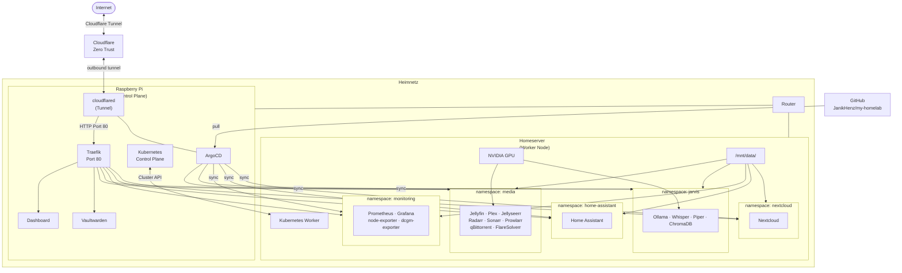
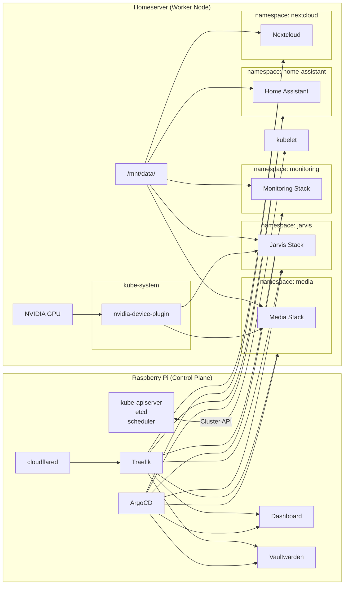
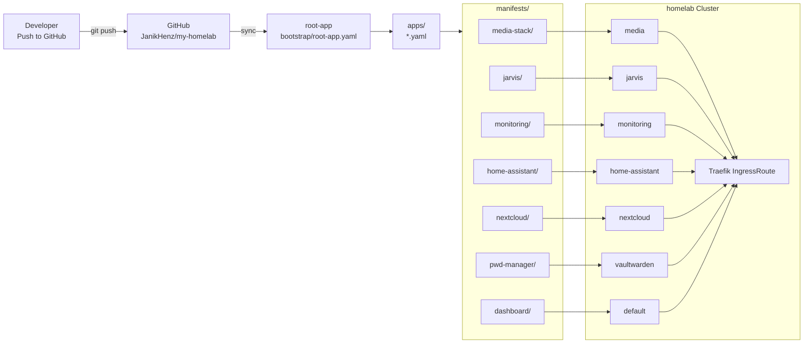
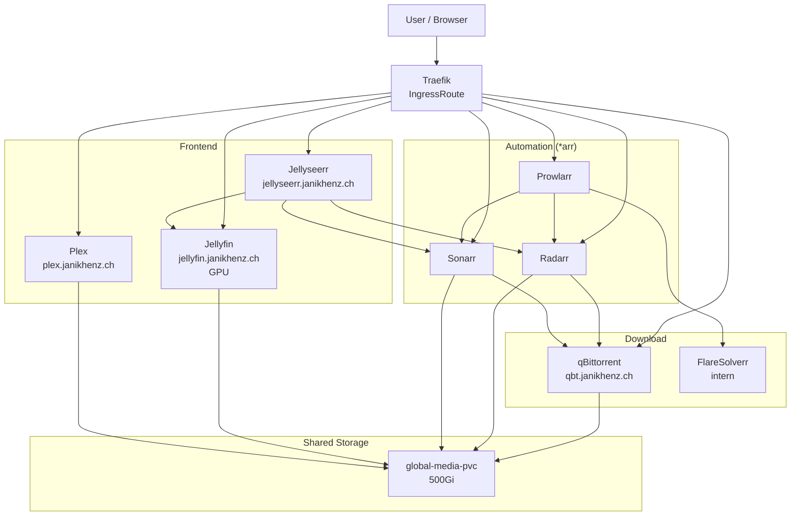
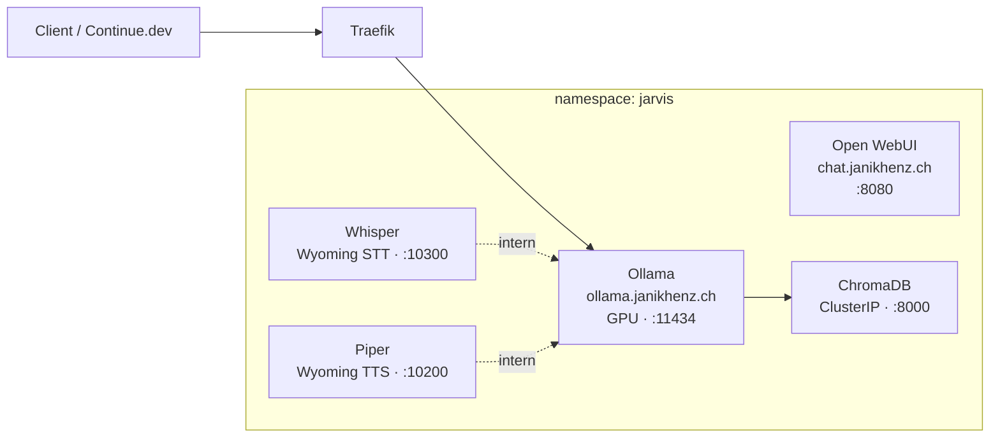
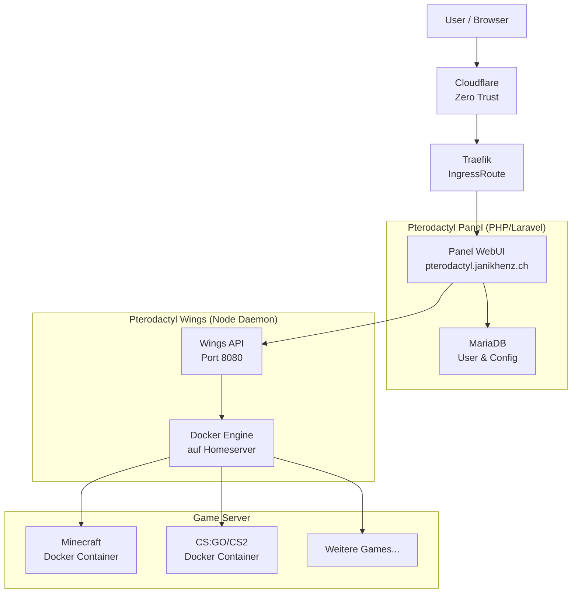
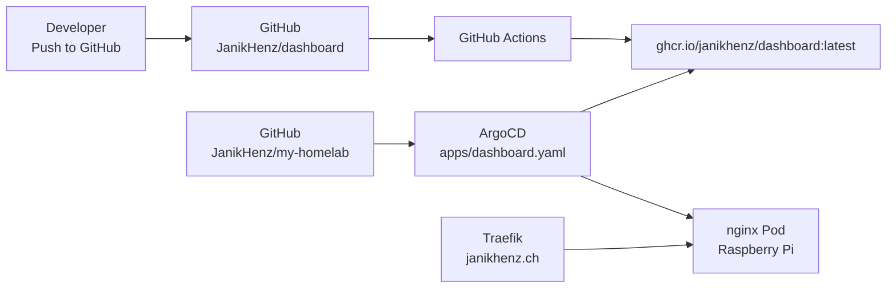
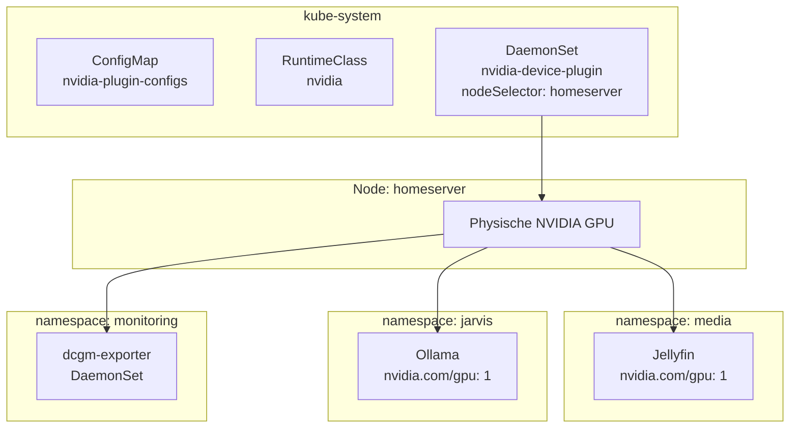

# My Homelab

Eine selbst gehostete Kubernetes-Infrastruktur auf einem **2-Node-Cluster** (Raspberry Pi als Control Plane + Homeserver als Worker Node) mit GitOps-Deployment via ArgoCD, Cloudflare Zero Trust + **Traefik Ingress** für externen Zugriff, NVIDIA GPU-Unterstützung für Jellyfin und Ollama sowie mehrere Applikations-Stacks.

**Stacks im Überblick**


| Stack            | Namespace        | Kurzbeschreibung                                   |
| ---------------- | ---------------- | -------------------------------------------------- |
| Media            | `media`          | Jellyfin, Plex, *arr, qBittorrent, FlareSolverr    |
| Jarvis           | `jarvis`         | Ollama (LLM), Open WebUI, Whisper, Piper, ChromaDB |
| Monitoring       | `monitoring`     | Prometheus, Grafana, node-exporter, DCGM Exporter  |
| Home Assistant   | `home-assistant` | Smart Home                                         |
| Nextcloud        | `nextcloud`      | Dateiablage                                        |
| Passwort-Manager | `vaultwarden`    | Vaultwarden (Bitwarden-kompatibel)                 |
| Gaming           | `gaming`         | Pterodactyl Panel & Wings (Game Server Management) |
| Dashboard        | `default`        | Zentrales Homelab-Dashboard (nginx auf dem Pi)     |


---

## Inhaltsverzeichnis

- [Screenshots](#screenshots)
- [Netzwerk-Topologie](#netzwerk-topologie)
- [Hardware & Cluster](#hardware--cluster)
- [GitOps-Architektur](#gitops-architektur)
- [Namespaces & Stacks](#namespaces--stacks)
- [Media Stack](#media-stack)
- [Jarvis Stack](#jarvis-stack)
- [Monitoring Stack](#monitoring-stack)
- [Home Assistant](#home-assistant)
- [Nextcloud](#nextcloud)
- [Vaultwarden](#vaultwarden)
- [Pterodactyl](#pterodactyl)
- [Dashboard](#dashboard)
- [Storage-Übersicht](#storage-übersicht)
- [NVIDIA GPU](#nvidia-gpu)
- [Jarvis Architektur (Detail)](#jarvis-architektur-detail)
- [Port-Übersicht](#port-übersicht)
- [Verzeichnisstruktur](#verzeichnisstruktur)
- [TODO](#todo)

---

## Screenshots

### ArgoCD — GitOps Dashboard


| ArgoCD Übersicht | Repository Sync |
| ---------------- | --------------- |
| ArgoCD Dashboard | ArgoCD Repos    |


### Kubernetes Cluster


| Pods            | Deployments            |
| --------------- | ---------------------- |
| Kubernetes Pods | Kubernetes Deployments |


| Services            | Persistent Volumes |
| ------------------- | ------------------ |
| Kubernetes Services | PV                 |


| PersistentVolumeClaims |
| ---------------------- |
| PVCs                   |


### Cloudflare Zero Trust


| Access Dashboard  |
| ----------------- |
| Cloudflare Access |


### Apps


| Dashboard | Jellyfin Media | Plex Media |
| --------- | -------------- | ---------- |
| Dashboard | Jellyfin       | Plex       |


---

## Netzwerk-Topologie

Beide Nodes sind direkt am Router im Heimnetz angeschlossen. Der **Raspberry Pi** fungiert als Kubernetes Control Plane und hostet ArgoCD, den `cloudflared`-Tunnel für externen Zugriff via **Cloudflare Zero Trust** sowie Vaultwarden und das Dashboard. Traffic von außen geht durch den Cloudflare Tunnel auf **Traefik** (Port 80), der dann anhand des Host-Headers per `IngressRoute` an den jeweiligen Service weiterleitet. Der **Homeserver** ist der einzige Worker Node und führt die meisten Workloads inkl. GPU-lastiger Apps aus.


```mermaid
graph TD
    INET(["Internet"])
    CF["Cloudflare\nZero Trust"]

    subgraph HOME["Heimnetz"]
        ROUTER["Router"]

        subgraph RASPY["Raspberry Pi\n(Control Plane)"]
            K8S_CP["Kubernetes\nControl Plane"]
            ARGO["ArgoCD"]
            CFD["cloudflared\n(Tunnel)"]
            TRAEFIK["Traefik\nPort 80"]
            DASH["Dashboard"]
            VW["Vaultwarden"]
        end

        subgraph SERVER["Homeserver\n(Worker Node)"]
            K8S_W["Kubernetes Worker"]
            GPU["NVIDIA GPU"]
            DISK["/mnt/data/"]

            subgraph NS_MEDIA["namespace: media"]
                MEDIA_APPS["Jellyfin · Plex · Jellyseerr\nRadarr · Sonarr · Prowlarr\nqBittorrent · FlareSolverr"]
            end
            subgraph NS_JARVIS["namespace: jarvis"]
                JARVIS_APPS["Ollama · Whisper · Piper · ChromaDB"]
            end
            subgraph NS_MON["namespace: monitoring"]
                MON_APPS["Prometheus · Grafana\nnode-exporter · dcgm-exporter"]
            end
            subgraph NS_HA["namespace: home-assistant"]
                HA["Home Assistant"]
            end
            subgraph NS_NC["namespace: nextcloud"]
                NC["Nextcloud"]
            end
        end
    end

    GH["GitHub\nJanikHenz/my-homelab"]

    INET <-->|"Cloudflare Tunnel"| CF
    CF <-->|"outbound tunnel"| CFD
    CFD -->|"HTTP Port 80"| TRAEFIK
    TRAEFIK --> NS_MEDIA
    TRAEFIK --> NS_JARVIS
    TRAEFIK --> NS_MON
    TRAEFIK --> NS_HA
    TRAEFIK --> NS_NC
    TRAEFIK --> DASH
    TRAEFIK --> VW
    CFD --- ARGO
    ROUTER --- RASPY
    ROUTER --- SERVER
    K8S_CP <-->|"Cluster API"| K8S_W
    ARGO -->|"sync"| NS_MEDIA
    ARGO -->|"sync"| NS_JARVIS
    ARGO -->|"sync"| NS_MON
    ARGO -->|"sync"| NS_HA
    ARGO -->|"sync"| NS_NC
    GH -->|"pull"| ARGO
    GPU --> MEDIA_APPS
    GPU --> JARVIS_APPS
    DISK --> NS_MEDIA
    DISK --> NS_JARVIS
    DISK --> NS_MON
    DISK --> NS_HA
    DISK --> NS_NC
```


---

## Hardware & Cluster

### Raspberry Pi – Control Plane


| Eigenschaft | Wert                                                 |
| ----------- | ---------------------------------------------------- |
| Rolle       | Kubernetes Control Plane                             |
| Software    | Kubernetes, ArgoCD, cloudflared, Traefik             |
| Workloads   | Dashboard, Vaultwarden (`nodeSelector: raspberrypi`) |


### Homeserver – Worker Node


| Eigenschaft | Wert                                     |
| ----------- | ---------------------------------------- |
| Hostname    | `homeserver`                             |
| Rolle       | Kubernetes Worker Node                   |
| GPU         | NVIDIA (Jellyfin, Ollama, dcgm-exporter) |
| Storage     | `/mnt/data/` (hostPath PVs)              |



```mermaid
graph LR
    subgraph RASPY["Raspberry Pi (Control Plane)"]
        CP["kube-apiserver\netcd\nscheduler"]
        ARGO["ArgoCD"]
        CFD["cloudflared"]
        TRAEFIK["Traefik"]
        DASH["Dashboard"]
        VW["Vaultwarden"]
    end

    subgraph SERVER["Homeserver (Worker Node)"]
        KW["kubelet"]
        GPU["NVIDIA GPU"]
        DISK["/mnt/data/"]

        subgraph SYS["kube-system"]
            NDP["nvidia-device-plugin"]
        end
        subgraph MEDIA_NS["namespace: media"]
            MEDIA["Media Stack"]
        end
        subgraph JARVIS_NS["namespace: jarvis"]
            JARVIS["Jarvis Stack"]
        end
        subgraph MON_NS["namespace: monitoring"]
            MON["Monitoring Stack"]
        end
        subgraph HA_NS["namespace: home-assistant"]
            HA["Home Assistant"]
        end
        subgraph NC_NS["namespace: nextcloud"]
            NC["Nextcloud"]
        end
    end

    CFD --> TRAEFIK
    CP <-->|"Cluster API"| KW
    ARGO --> MEDIA_NS
    ARGO --> JARVIS_NS
    ARGO --> MON_NS
    ARGO --> HA_NS
    ARGO --> NC_NS
    ARGO --> DASH
    ARGO --> VW
    TRAEFIK --> MEDIA_NS
    TRAEFIK --> JARVIS_NS
    TRAEFIK --> MON_NS
    TRAEFIK --> HA_NS
    TRAEFIK --> NC_NS
    TRAEFIK --> DASH
    TRAEFIK --> VW
    GPU --> NDP
    NDP --> MEDIA
    NDP --> JARVIS
    DISK --> MEDIA
    DISK --> JARVIS
    DISK --> MON
    DISK --> HA
    DISK --> NC
```


---

## GitOps-Architektur

Das Deployment folgt dem **App of Apps**-Pattern. ArgoCD überwacht das GitHub-Repository und synchronisiert automatisch alle Änderungen in den Cluster.


```mermaid
flowchart LR
    DEV["Developer\nPush to GitHub"]
    GH["GitHub\nJanikHenz/my-homelab"]
    ROOT["root-app\nbootstrap/root-app.yaml"]
    APPS["apps/\n*.yaml"]

    subgraph MANIFESTS["manifests/"]
        MS["media-stack/"]
        JV["jarvis/"]
        MO["monitoring/"]
        HA["home-assistant/"]
        NC["nextcloud/"]
        PW["pwd-manager/"]
        DS["dashboard/"]
    end

    subgraph CLUSTER["homelab Cluster"]
        NS_MEDIA["media"]
        NS_JARVIS["jarvis"]
        NS_MON["monitoring"]
        NS_HA["home-assistant"]
        NS_NC["nextcloud"]
        NS_VW["vaultwarden"]
        NS_DEF["default"]
        TRAEFIK["Traefik IngressRoute"]
    end

    DEV -->|git push| GH
    GH -->|sync| ROOT
    ROOT --> APPS
    APPS --> MANIFESTS
    MS --> NS_MEDIA
    JV --> NS_JARVIS
    MO --> NS_MON
    HA --> NS_HA
    NC --> NS_NC
    PW --> NS_VW
    DS --> NS_DEF
    NS_MEDIA --> TRAEFIK
    NS_JARVIS --> TRAEFIK
    NS_MON --> TRAEFIK
    NS_HA --> TRAEFIK
    NS_NC --> TRAEFIK
    NS_VW --> TRAEFIK
    NS_DEF --> TRAEFIK
```


### Sync-Policy

Alle ArgoCD Applications haben:

- `**automated.prune: true**` – verwaiste Ressourcen werden gelöscht
- `**automated.selfHeal: true**` – manuelle Cluster-Änderungen werden revertiert (nur root-app)

---

## Namespaces & Stacks


| Namespace        | ArgoCD Apps                                                                     | Beschreibung                            |
| ---------------- | ------------------------------------------------------------------------------- | --------------------------------------- |
| `media`          | jellyfin, plex, jellyseerr, radarr, sonarr, prowlarr, qbittorrent, flaresolverr | Medien-Automation und Streaming         |
| `jarvis`         | ollama, whisper, piper, chromadb                                                | Lokales LLM, Sprache und Vektorspeicher |
| `monitoring`     | monitoring (Prometheus, Grafana, Exporter)                                      | Metriken und Dashboards                 |
| `home-assistant` | home-assistant                                                                  | Smart Home                              |
| `nextcloud`      | nextcloud                                                                       | Cloud-Speicher                          |
| `vaultwarden`    | pwd-manager                                                                     | Passwort-Tresor                         |
| `gaming`         | pterodactyl                                                                     | Game Server Management                  |
| `default`        | dashboard                                                                       | Homelab-Startseite                      |


---

## Media Stack

Der Media Stack automatisiert das gesamte Medien-Management von der Suche über den Download bis zur Wiedergabe.

### Datenfluss


```mermaid
flowchart TD
    USER["User / Browser"]
    TRAEFIK["Traefik\nIngressRoute"]

    subgraph FRONTEND["Frontend"]
        JS["Jellyseerr\njellyseerr.janikhenz.ch"]
        JF["Jellyfin\njellyfin.janikhenz.ch\nGPU"]
        PL["Plex\nplex.janikhenz.ch"]
    end

    subgraph AUTOMATION["Automation (*arr)"]
        RD["Radarr"]
        SN["Sonarr"]
        PR["Prowlarr"]
    end

    subgraph DOWNLOAD["Download"]
        QB["qBittorrent\nqbt.janikhenz.ch"]
        FS["FlareSolverr\nintern"]
    end

    subgraph STORAGE["Shared Storage"]
        GMP["global-media-pvc\n500Gi"]
    end

    USER --> TRAEFIK
    TRAEFIK --> JS
    TRAEFIK --> JF
    TRAEFIK --> PL
    TRAEFIK --> RD
    TRAEFIK --> SN
    TRAEFIK --> PR
    TRAEFIK --> QB

    JS --> SN
    JS --> RD
    JS --> JF
    PR --> RD
    PR --> SN
    PR --> FS
    RD --> QB
    SN --> QB
    QB --> GMP
    RD --> GMP
    SN --> GMP
    JF --> GMP
    PL --> GMP
```


### Services & Images


| Service      | Image                                      | Port  | NodePort | Subdomain (Traefik)       | GPU |
| ------------ | ------------------------------------------ | ----- | -------- | ------------------------- | --- |
| Jellyfin     | `jellyfin/jellyfin:latest`                 | 8096  | 30001    | `jellyfin.janikhenz.ch`   | ja  |
| Plex         | `plexinc/pms-docker:latest`                | 32400 | 30002    | `plex.janikhenz.ch`       |     |
| Jellyseerr   | `ghcr.io/seerr-team/seerr:latest`          | 5055  | 30003    | `jellyseerr.janikhenz.ch` |     |
| Radarr       | `linuxserver/radarr:latest`                | 7878  | 30004    | `radarr.janikhenz.ch`     |     |
| Sonarr       | `linuxserver/sonarr:latest`                | 8989  | 30005    | `sonarr.janikhenz.ch`     |     |
| Prowlarr     | `linuxserver/prowlarr:latest`              | 9696  | 30006    | `prowlarr.janikhenz.ch`   |     |
| qBittorrent  | `linuxserver/qbittorrent:latest`           | 8080  | 30007    | `qbt.janikhenz.ch`        |     |
| FlareSolverr | `ghcr.io/flaresolverr/flaresolverr:latest` | 8191  | —        | intern                    |     |


> **qBittorrent Torrent-Port:** Port 6881 TCP/UDP läuft als separater `NodePort 30008` (`qbittorrent-torrent-service`), da Raw-TCP/UDP-Traffic nicht durch Traefiks HTTP-Layer geroutet werden kann.

---

## Jarvis Stack

Lokaler KI-Stack im Namespace `jarvis` für LLM-Inferenz, Chat-Interface, Spracherkennung, Sprachausgabe und Vektorspeicher. Open WebUI bietet eine moderne Weboberfläche für Ollama mit Chat-Verlauf, Model-Management und RAG-Funktionen. Details und Betriebsregeln siehe [Jarvis Architektur (Detail)](#jarvis-architektur-detail).


```mermaid
flowchart LR
    USER["Client / Continue.dev"]
    TRAEFIK["Traefik"]

    subgraph JARVIS["namespace: jarvis"]
        OL["Ollama\nollama.janikhenz.ch\nGPU · :11434"]
        OW["Open WebUI\nchat.janikhenz.ch\n:8080"]
        WH["Whisper\nWyoming STT · :10300"]
        PI["Piper\nWyoming TTS · :10200"]
        CH["ChromaDB\nClusterIP · :8000"]
    end

    USER --> TRAEFIK
    TRAEFIK --> OL
    WH -.->|"intern"| OL
    PI -.->|"intern"| OL
    OL --> CH
```


| Service  | Image                            | Port  | NodePort | Subdomain (Traefik)     | GPU |
| -------- | -------------------------------- | ----- | -------- | ----------------------- | --- |
| Ollama   | `ollama/ollama:latest`           | 11434 | 30013    | `ollama.janikhenz.ch`   | ja  |
| Whisper  | `rhasspy/wyoming-whisper:latest` | 10300 | 30014    | — (nur intern/NodePort) |     |
| Piper    | `rhasspy/wyoming-piper:latest`   | 10200 | 30015    | —                       |     |
| ChromaDB | `chromadb/chroma:latest`         | 8000  | —        | intern (ClusterIP)      |     |


---

## Monitoring Stack

Prometheus sammelt Metriken vom Cluster, node-exporter liefert Host-Metriken und dcgm-exporter GPU-Metriken vom Homeserver. Grafana visualisiert alles unter `grafana.janikhenz.ch`.


| Komponente    | Image / Typ                                    | Port | NodePort | Subdomain (Traefik)       |
| ------------- | ---------------------------------------------- | ---- | -------- | ------------------------- |
| Prometheus    | `prom/prometheus:latest`                       | 9090 | 30090    | `prometheus.janikhenz.ch` |
| Grafana       | `grafana/grafana:latest`                       | 3000 | 30091    | `grafana.janikhenz.ch`    |
| node-exporter | `prom/node-exporter` (DaemonSet)               | 9100 | —        | intern                    |
| dcgm-exporter | `nvcr.io/nvidia/k8s/dcgm-exporter` (DaemonSet) | 9400 | —        | intern (GPU-Metriken)     |


---

## Home Assistant


| Eigenschaft | Wert                                           |
| ----------- | ---------------------------------------------- |
| Image       | `ghcr.io/home-assistant/home-assistant:stable` |
| Node        | `homeserver`                                   |
| Port        | 8123                                           |
| NodePort    | 30009                                          |
| URL         | `https://homeassistant.janikhenz.ch`           |
| Config-PVC  | `home-assistant-config-pvc` (5 Gi)             |


---

## Nextcloud


| Eigenschaft | Wert                             |
| ----------- | -------------------------------- |
| Image       | `nextcloud:latest`               |
| Node        | `homeserver`                     |
| Port        | 80                               |
| NodePort    | 30012                            |
| URL         | `https://nextcloud.janikhenz.ch` |
| Data-PVC    | `nextcloud-data-pvc` (100 Gi)    |


---

## Vaultwarden

Bitwarden-kompatibler Passwort-Manager auf dem Raspberry Pi.


| Eigenschaft | Wert                          |
| ----------- | ----------------------------- |
| Image       | `vaultwarden/server:latest`   |
| Node        | `raspberrypi`                 |
| Port        | 80                            |
| NodePort    | 30011                         |
| URL         | `https://vault.janikhenz.ch`  |
| Data-PVC    | `vaultwarden-data-pvc` (1 Gi) |


---

## Pterodactyl

Ein Open-Source Game Server Management Panel mit einem webbasierten Control Panel (Panel) und einem Node-Daemon (Wings) zur Verwaltung von Docker-basierten Game Servern. Pterodactyl erlaubt das einfache Erstellen, Konfigurieren und Verwalten von Minecraft, CS:GO, Valheim und vielen anderen Game Servern über eine moderne Web-Oberfläche.

### Architektur


```mermaid
flowchart TD
    USER["User / Browser"]
    CF["Cloudflare\nZero Trust"]
    TRAEFIK["Traefik\nIngressRoute"]

    subgraph PANEL["Pterodactyl Panel (PHP/Laravel)"]
        PP["Panel WebUI\npterodactyl.janikhenz.ch"]
        MARIA["MariaDB\nUser & Config"]
    end

    subgraph WINGS["Pterodactyl Wings (Node Daemon)"]
        PW["Wings API\nPort 8080"]
        DOCKER["Docker Engine\nauf Homeserver"]
    end

    subgraph SERVERS["Game Server"]
        MC["Minecraft\nDocker Container"]
        CS["CS:GO/CS2\nDocker Container"]
        OTHER["Weitere Games..."]
    end

    USER --> CF
    CF --> TRAEFIK
    TRAEFIK --> PP
    PP --> MARIA
    PP --> PW
    PW --> DOCKER
    DOCKER --> MC
    DOCKER --> CS
    DOCKER --> OTHER
```

### Komponenten

| Komponente | Image                           | Port  | NodePort | Zweck                          |
| ---------- | ------------------------------- | ----- | -------- | ------------------------------ |
| Panel      | `ghcr.io/pterodactyl/panel:v1.11.7` | 80    | 30020    | WebUI für Server-Management    |
| MariaDB    | `mariadb:10.11`                 | 3306  | —        | Datenbank für Panel            |
| Wings      | `ghcr.io/pterodactyl/wings:v1.11.13` | 8080  | —        | Node-Daemon (hostNetwork)      |

### Konfiguration

Bevor dem ersten Deployment müssen die Secrets angepasst werden:

```bash
# Passwörter generieren
openssl rand -base64 32  # für mariadb-root-password
openssl rand -base64 32  # für mariadb-password
openssl rand -base64 32  # für app-key (mit base64: Präfix)
```

Dann in `manifests/gaming/pterodactyl/pterodactyl-secrets.yaml` eintragen.

### Erstkonfiguration Wings

Nach dem ersten Panel-Start:

1. Auf `https://pterodactyl.janikhenz.ch` einloggen (admin / [aus Secret])
2. Admin-Account erstellen und einloggen
3. Im Admin-Bereich einen neuen **Node** erstellen:
   - Name: `homeserver`
   - FQDN: `homeserver` (interner DNS oder IP)
   - Memory: z. B. `8192` (8 GB)
   - Disk: z. B. `50000` (50 GB)
4. Die `config.yml` für Wings generieren und im PVC speichern:
   ```bash
   kubectl cp config.yml gaming/pterodactyl-wings-pod:/etc/pterodactyl/config.yml
   ```
5. Wings-Pod neustarten

### Storage

| PVC                           | Grösse | Access | Mount-Punkt (im Pod)           |
| ----------------------------- | ------ | ------ | ------------------------------ |
| `pterodactyl-panel-config-pvc` | 5 Gi   | RWO    | `/app/storage`                 |
| `pterodactyl-mariadb-pvc`      | 10 Gi  | RWO    | `/var/lib/mysql`               |
| `pterodactyl-wings-config-pvc` | 5 Gi   | RWO    | `/etc/pterodactyl`             |
| `pterodactyl-servers-pvc`      | 100 Gi | RWX    | `/var/lib/pterodactyl/volumes` |

### URL & Zugriff

| Service | URL                               | Anmeldedaten            |
| ------- | --------------------------------- | ----------------------- |
| Panel   | `https://pterodactyl.janikhenz.ch` | Admin aus Secrets       |
| NodePort| `http://homeserver:30020`          | (lokaler Zugriff)       |

> **Wichtig:** Wings läuft mit `hostNetwork: true` und `privileged: true`, um Docker-Container für Game Server starten zu können. Dies ist für die Funktionalität erforderlich.

---

## Dashboard

Eine selbst gehostete Web-Oberfläche auf dem **Raspberry Pi**, die als zentrales Homelab-Dashboard dient. Die Seite besteht aus reinem HTML/CSS/JS und wird über ein nginx-Image bereitgestellt, das automatisch via GitHub Actions gebaut und via ArgoCD deployed wird.

### Deployment-Flow


```mermaid
flowchart LR
    DEV["Developer\nPush to GitHub"]
    GH_DASH["GitHub\nJanikHenz/dashboard"]
    GH_ACT["GitHub Actions"]
    GHCR["ghcr.io/janikhenz/dashboard:latest"]
    GH_HOME["GitHub\nJanikHenz/my-homelab"]
    ARGO["ArgoCD\napps/dashboard.yaml"]
    POD["nginx Pod\nRaspberry Pi"]
    TRAEFIK["Traefik\njanikhenz.ch"]

    DEV --> GH_DASH
    GH_DASH --> GH_ACT
    GH_ACT --> GHCR
    ARGO --> GHCR
    GH_HOME --> ARGO
    ARGO --> POD
    TRAEFIK --> POD
```


### Details


| Eigenschaft | Wert                                                          |
| ----------- | ------------------------------------------------------------- |
| Image       | `ghcr.io/janikhenz/dashboard:latest`                          |
| Node        | `raspberrypi`                                                 |
| NodePort    | 30080                                                         |
| URL         | `https://janikhenz.ch`                                        |
| Source Repo | [JanikHenz/dashboard](https://github.com/JanikHenz/dashboard) |


---

## Storage-Übersicht


| PVC                         | Größe  | Access Mode | Pfad auf Host                     | Konsumenten                          |
| --------------------------- | ------ | ----------- | --------------------------------- | ------------------------------------ |
| `jellyfin-config-pvc`       | 10 Gi  | RWO         | `/mnt/data/jellyfin/config`       | Jellyfin                             |
| `plex-config-pvc`           | 10 Gi  | RWO         | `/mnt/data/plex/config`           | Plex                                 |
| `radarr-config-pvc`         | 1 Gi   | RWO         | `/mnt/data/radarr/config`         | Radarr                               |
| `sonarr-config-pvc`         | 1 Gi   | RWO         | `/mnt/data/sonarr/config`         | Sonarr                               |
| `qbittorrent-config-pvc`    | 1 Gi   | RWO         | `/mnt/data/qbittorrent/config`    | qBittorrent                          |
| `prowlarr-config-pvc`       | 1 Gi   | RWO         | `/mnt/data/prowlarr/config`       | Prowlarr                             |
| `jellyseerr-config-pvc`     | 5 Gi   | RWO         | `/mnt/data/jellyseerr/config`     | Jellyseerr                           |
| `global-media-pvc`          | 500 Gi | **RWX**     | `/mnt/data/media`                 | Jellyfin, Plex, Radarr, Sonarr, qBit |
| `ollama-config-pvc`         | 50 Gi  | RWO         | `/mnt/data/ollama/config`         | Ollama (Modelle)                     |
| `chromadb-pvc`              | 5 Gi   | RWO         | `/mnt/data/chromadb`              | ChromaDB                             |
| `prometheus-pvc`            | 10 Gi  | RWO         | `/mnt/data/prometheus`            | Prometheus                           |
| `grafana-pvc`               | 2 Gi   | RWO         | `/mnt/data/grafana`               | Grafana                              |
| `home-assistant-config-pvc` | 5 Gi   | RWO         | `/mnt/data/home-assistant/config` | Home Assistant                       |
| `nextcloud-data-pvc`        | 100 Gi | RWO         | `/mnt/data/nextcloud/data`        | Nextcloud                            |
| `vaultwarden-data-pvc`      | 1 Gi   | RWO         | `/mnt/data/vaultwarden/data`      | Vaultwarden                          |


---

## NVIDIA GPU

Die GPU wird über den **NVIDIA Device Plugin** bereitgestellt. Aktuell nutzen **Jellyfin** (Hardware-Transcoding) und **Ollama** (LLM-Inferenz) jeweils eine GPU. Der **DCGM Exporter** im Monitoring-Namespace liefert GPU-Metriken an Prometheus.


```mermaid
flowchart TD
    subgraph KUBE_SYSTEM["kube-system"]
        CM["ConfigMap\nnvidia-plugin-configs"]
        RC["RuntimeClass\nnvidia"]
        DS["DaemonSet\nnvidia-device-plugin\nnodeSelector: homeserver"]
    end

    subgraph NODE["Node: homeserver"]
        GPU_HW["Physische NVIDIA GPU"]
    end

    subgraph MEDIA["namespace: media"]
        JF["Jellyfin\nnvidia.com/gpu: 1"]
    end

    subgraph JARVIS["namespace: jarvis"]
        OL["Ollama\nnvidia.com/gpu: 1"]
    end

    subgraph MON["namespace: monitoring"]
        DCGM["dcgm-exporter\nDaemonSet"]
    end

    DS --> GPU_HW
    GPU_HW --> JF
    GPU_HW --> OL
    GPU_HW --> DCGM
```


**Konfiguration (nvidia-plugin-configs)**

- `migStrategy: none`
- `deviceListStrategy: envvar`
- `deviceIDStrategy: uuid`

> Jellyfin und Ollama teilen sich dieselbe physische GPU. Gleichzeitiger Volllast-Betrieb kann zu Ressourcenkonflikten führen.

---

## Jarvis Architektur (Detail)

Die technische Zielarchitektur für den Jarvis-Stack, Betriebsregeln, Recovery-Runbook und Continue.dev-Setup findest du in:

- `[docs/jarvis-architecture.md](docs/jarvis-architecture.md)`

---

## Port-Übersicht

Öffentliche HTTP-Services sind per **NodePort** lokal im Heimnetz erreichbar und extern über Traefik + Cloudflare Tunnel (Subdomain).

### Öffentlicher Zugang (NodePort + Traefik IngressRoute)


| Service           | Namespace      | Container-Port | NodePort  | Lokale URL                    | Externe URL (Traefik)                |
| ----------------- | -------------- | -------------- | --------- | ----------------------------- | ------------------------------------ |
| Dashboard (nginx) | default        | 80             | **30080** | `http://raspberrypi:30080`    | `https://janikhenz.ch`               |
| Jellyfin          | media          | 8096           | **30001** | `http://homeserver:30001`     | `https://jellyfin.janikhenz.ch`      |
| Plex              | media          | 32400          | **30002** | `http://homeserver:30002/web` | `https://plex.janikhenz.ch`          |
| Jellyseerr        | media          | 5055           | **30003** | `http://homeserver:30003`     | `https://jellyseerr.janikhenz.ch`    |
| Radarr            | media          | 7878           | **30004** | `http://homeserver:30004`     | `https://radarr.janikhenz.ch`        |
| Sonarr            | media          | 8989           | **30005** | `http://homeserver:30005`     | `https://sonarr.janikhenz.ch`        |
| Prowlarr          | media          | 9696           | **30006** | `http://homeserver:30006`     | `https://prowlarr.janikhenz.ch`      |
| qBittorrent WebUI | media          | 8080           | **30007** | `http://homeserver:30007`     | `https://qbt.janikhenz.ch`           |
| Home Assistant    | home-assistant | 8123           | **30009** | `http://homeserver:30009`     | `https://homeassistant.janikhenz.ch` |
| Vaultwarden       | vaultwarden    | 80             | **30011** | `http://raspberrypi:30011`    | `https://vault.janikhenz.ch`         |
| Nextcloud         | nextcloud      | 80             | **30012** | `http://homeserver:30012`     | `https://nextcloud.janikhenz.ch`     |
| Ollama            | jarvis         | 11434          | **30013** | `http://homeserver:30013`     | `https://ollama.janikhenz.ch`        |
| Open WebUI        | jarvis         | 8080           | **30016** | `http://homeserver:30016`     | `https://chat.janikhenz.ch`          |
| Whisper           | jarvis         | 10300          | **30014** | `http://homeserver:30014`     | —                                    |
| Piper             | jarvis         | 10200          | **30015** | `http://homeserver:30015`     | —                                    |
| Prometheus        | monitoring     | 9090           | **30090** | `http://homeserver:30090`     | `https://prometheus.janikhenz.ch`    |
| Grafana           | monitoring     | 3000           | **30091** | `http://homeserver:30091`     | `https://grafana.janikhenz.ch`       |
| Pterodactyl Panel | gaming         | 80             | **30020** | `http://homeserver:30020`     | `https://pterodactyl.janikhenz.ch`   |


### NodePort (Torrent-Protokoll — kein HTTP, kein Traefik)


| Service                     | Namespace | Port         | NodePort  | Zweck                       |
| --------------------------- | --------- | ------------ | --------- | --------------------------- |
| qbittorrent-torrent-service | media     | 6881 TCP/UDP | **30008** | Torrent-Peers (Raw TCP/UDP) |


### Interne ClusterIP (kein öffentlicher Zugang)


| Service          | Namespace  | Port | Konsumenten     |
| ---------------- | ---------- | ---- | --------------- |
| FlareSolverr     | media      | 8191 | Prowlarr        |
| chromadb-service | jarvis     | 8000 | Jarvis / Ollama |
| node-exporter    | monitoring | 9100 | Prometheus      |
| dcgm-exporter    | monitoring | 9400 | Prometheus      |


---

## Verzeichnisstruktur

```
my-homelab/
├── bootstrap/
│   └── root-app.yaml              # ArgoCD App of Apps
│
├── apps/                          # ArgoCD Application-Definitionen
│   ├── dashboard.yaml
│   ├── monitoring.yaml
│   ├── home-assistant.yaml
│   ├── nextcloud.yaml
│   ├── pwd-manager.yaml
│   ├── ollama.yaml
│   ├── openwebui.yaml
│   ├── whisper.yaml
│   ├── piper.yaml
│   ├── chromadb.yaml
│   ├── jellyfin.yaml
│   ├── plex.yaml
│   ├── jellyseerr.yaml
│   ├── radarr.yaml
│   ├── sonarr.yaml
│   ├── prowlarr.yaml
│   ├── qbittorrent.yaml
│   └── flaresolverr.yaml
│   └── pterodactyl.yaml
│
├── infrastrucure/                 # Cluster-weite Ressourcen
│   ├── namespaces.yaml
│   ├── media-storage.yaml
│   ├── jarvis-storage.yaml
│   ├── monitoring-storage.yaml
│   ├── home-assistant-storage.yaml
│   ├── nextcloud-storage.yaml
│   ├── pwd-manager-storage.yaml
│   ├── gaming-storage.yaml
│   ├── daemonset.yaml             # NVIDIA Device Plugin
│   ├── nvidia-plugin-config.yaml
│   └── nvidia-runtimeclass.yaml
│
├── manifests/
│   ├── dashboard/
│   ├── media-stack/
│   │   ├── jellyfin/
│   │   ├── plex/
│   │   ├── jellyseerr/
│   │   ├── radarr/
│   │   ├── sonarr/
│   │   ├── prowlarr/
│   │   ├── qbittorrent/
│   │   └── flaresolverr/
│   ├── jarvis/
│   │   ├── ollama/
│   │   ├── openwebui/
│   │   ├── whisper/
│   │   ├── piper/
│   │   └── chromadb/
│   ├── monitoring/
│   ├── home-assistant/
│   ├── nextcloud/
│   ├── pwd-manager/
│   └── gaming/
│       └── pterodactyl/
│
└── docs/
    ├── jarvis-architecture.md
    └── img/                       # Screenshots für dieses README
```

---

## TODO

- Ollama llm verbessern
- Pi-hole via Kubernetes installieren und in GitOps aufnehmen
- Eigene Fitness/Tracking-App implementieren

